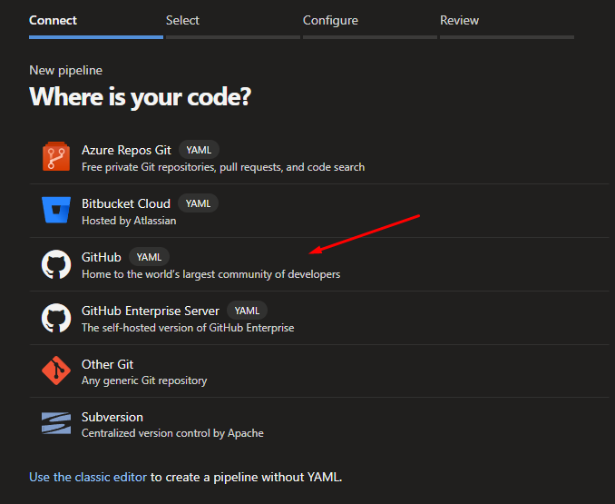
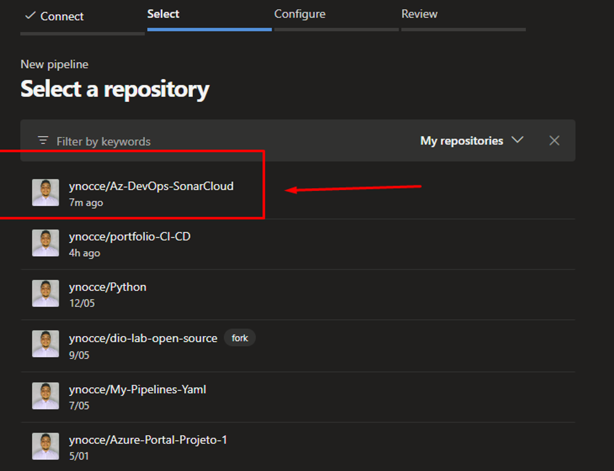

# Como implementar o SonarCloud no Azure Pipelines - Build .NET

Esse tutorial tem como objetivo implementar o SonarCloud em uma pipeline Yaml .NET  no Azure DevOps, usando:

- **GitHub**
- **Azure Pipelines**
- **SonarCloud**

- **Criando uma Pipeline yaml .NET no Azure DevOps:**
    - A Pipeline Yaml utilizada está no repos do GitHub.
    
    
    
    
    
    
    
    - Pronto adicionamos nossa pipeline .Net no Azure DevOps.
        
        Nota: O yaml se encontra no GitHub, junto com a build .NET utilizada.
        
    
    
    
- **Criando uma Service Connection do SonarCloud com o Azure DevOps:**
    
    1 - Crie uma conta no SonarCloud: [https://sonarcloud.io/](https://sonarcloud.io/)
    2 - Configure sua conta do SonarCloud.
    3 - Acesse esse link para conseguir as informações para criar a Service Connection: [https://docs.sonarsource.com/sonarcloud/getting-started/azure-devops/](https://docs.sonarsource.com/sonarcloud/getting-started/azure-devops/)
    4 - Acesse o Azure DevOps → Project Settings → Service Connections.
    5 - Clique em New Service Connection e procure SonarCloud.
    
    
    
    6 - Prencha as informações da Service Connection e clique em verificar.
    
    - Tokken (pode ser encontrado no seu SonarCloud)
    - Nome da Service Connection
    
    
    
- **Adicionando as task do SonarCloud na pipeline Yaml:**
    
    1 - Abra a pipeline Yaml e Clique em editar:
    2 - Procure as task do SonarCloud
    Nota: Caso não apareça as task, você tera que adicionar no seu Azure DevOps pelo marketplace.
    
    3 - Adicione as task na sequencia abaixo:
    
    - Prepare Analysis Configuration
    - Run Code Analysis
    - Publish Quality Gate Result
    
    4 - Na task de Prepare Analysis Configuration, adicione a Service Connection → Organização → O time de Analysis → Project Key → Project Name.
    
    
    
    5 - Deixe as task nessa sequencia e clique em salvar.
    
    
    
- **Criando o Projeto no SonarCloud:**
    
    Para que analise funcione, precisamos criar o projeto no SonarCloud.
    Crie sua organização (Pode ser usando O GitHub)
    Nota: O Projeto/Repos tem que ser publico, se não você vai ter que possuir uma assinatura.
    
    1 - Acesse sua organização criada.
    
    
    
    2 - Crie um novo Projeto e selecione o repos que será analisado pelo SonarCloud.
    
    
    
    
    
    3 - Agora com o projeto criado, procure por “information” lá você ira encontrar a Key do projeto.
    
    
    
    
    
    4 - Copie a Project Key e coloque no Yaml, confome abaixo:
    
    
    
    5 - Salve a pipeline e clique em Run.
    
    
    
- **Como ver sua analise no SonarCloud:**
    
    1 - Acesse sua organização e procure seus projetos, você ira ver o Projeto criado e sua analise:
    
    
    
    2 - No sonarCloud você ira ver toda Analise do seu codígo, atividade e Issues.
    
    
    

Prontinho! agora só corrigir as falhas do seu código e sempre faça sua analise.

Qualquer dúvida ou sujestão só informar.
